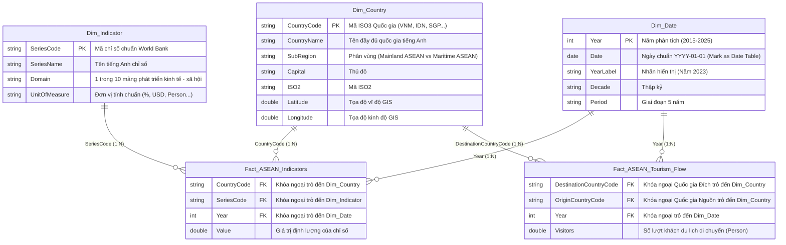

# PHÂN TÍCH PHÁT TRIỂN KINH TẾ - XÃ HỘI KHỐI ASEAN (2015 - 2025)

**Dự án Capstone:** Hệ thống Data Engineering tự động, Mô hình hóa Dữ liệu Star Schema, Bộ Kiểm thử CI/CD Data Quality và Giải pháp Báo cáo Quản trị Power BI Business Intelligence.

[](file:///D:/kelangthanghocIT/UTH/capstone-asean_overview_analysis/08_Source_Code/main.py)
[](file:///D:/kelangthanghocIT/UTH/capstone-asean_overview_analysis/08_Source_Code/src/test_suite.py)
[](file:///D:/kelangthanghocIT/UTH/capstone-asean_overview_analysis/05_PowerBI)
[](https://databank.worldbank.org/)

---

## I. TỔNG QUAN CHIẾN LƯỢC VÀ PHẠM VI DỰ ÁN

Dự án **Phân tích Phát triển Kinh tế - Xã hội Khối ASEAN (2015 – 2025)** xây dựng một nền tảng dữ liệu toàn diện phục vụ việc đánh giá hiệu quả phát triển vĩ mô, mức độ chuyển đổi số, độ mở thương mại và hạ tầng an sinh xã hội của các quốc gia Đông Nam Á.

Hệ thống được thiết kế theo tiêu chuẩn Data Engineering hiện đại, xử lý toàn bộ quy trình từ thu thập dữ liệu thô dạng bảng ngang (Wide Format), tự động chuyển đổi sang dạng dọc (Long Format), làm sạch ký tự dị thường, gán mã chuẩn hóa ISO3, đến xây dựng **Mô hình Dữ liệu Ngôi sao 3 Lớp (3-Tier Star Schema)** tối ưu hóa cho động cơ nén VertiPaq trên Power BI.

### 1. Quy mô và Phạm vi Phân tích
- **Phạm vi Địa lý:** 10 quốc gia thành viên chính thức ASEAN (Brunei Darussalam, Cambodia, Indonesia, Lao PDR, Malaysia, Myanmar, Philippines, Singapore, Thailand, Viet Nam) và 1 quốc gia quan sát viên (Timor-Leste).
- **Phạm vi Thời gian:** Chuỗi thời gian 11 năm (từ 2015 đến 2025).
- **Dung lượng Dữ liệu Sạch:** 65 chỉ số vĩ mô (6,730 bản ghi sự kiện), ma trận luồng du khách nội khối (908 bản ghi sự kiện luồng) và 7,850 bản ghi master phục vụ đối soát.
- **Nguồn Dữ liệu Gốc:** Chỉ số Phát triển Thế giới (World Bank World Development Indicators - WDI) và Thống kê Du lịch ASEAN (ASEAN Tourism Statistics).

### 2. Danh mục 10 Nhóm Lĩnh vực Trọng yếu

| STT | Nhóm Lĩnh Vực (Domain) | Phạm Vi Phân Tích & Chỉ Số Trọng Tâm | Số Chỉ Số | Đơn Vị Tính Chính |
| :---: | :--- | :--- | :---: | :--- |
| 1 | **Kinh tế & GDP** | Quy mô GDP, tăng trưởng thực tế, GDP bình quân, lạm phát CPI, nợ công chính phủ, tích lũy tài sản và tiết kiệm. | 7 | `USD`, `% GDP`, `% annual` |
| 2 | **Dân số & Nhân khẩu học** | Quy mô dân số, cơ cấu giới tính, tỷ lệ đô thị hóa, tỷ lệ sinh và tỷ lệ phụ thuộc tuổi (trẻ em/người già). | 13 | `Person`, `% total`, `births/woman` |
| 3 | **Thương mại & Xuất nhập khẩu** | Kim ngạch xuất nhập khẩu hàng hóa/dịch vụ, xuất nhập khẩu thương mại và độ mở nền kinh tế (% GDP). | 6 | `USD`, `% GDP` |
| 4 | **Đầu tư trực tiếp nước ngoài (FDI)** | Dòng vốn FDI ròng vào (inflows), dòng vốn FDI ròng ra (outflows) và tỷ trọng FDI ròng vào so với GDP. | 3 | `USD`, `% GDP` |
| 5 | **Công nghệ & Hạ tầng số** | Tỷ lệ phổ cập Internet, mật độ thuê bao di động, kết nối băng rộng cố định và hạ tầng máy chủ bảo mật. | 4 | `% population`, `per 100/1M people` |
| 6 | **Giáo dục & Đào tạo** | Tỷ lệ biết chữ ở người trưởng thành, tỷ lệ nhập học 3 cấp (Tiểu học, Trung học, Đại học) phân tách giới và chi tiêu giáo dục. | 11 | `% gross`, `% population`, `% GDP` |
| 7 | **Lao động & Việc làm** | Tỷ lệ tham gia lực lượng lao động, tỷ lệ thất nghiệp (chung/thanh niên) và cơ cấu việc làm 3 ngành (Nông/Công/Dịch vụ). | 6 | `% labor force`, `% employment` |
| 8 | **Môi trường & Năng lượng** | Tỷ lệ tiếp cận điện lưới, năng lượng tái tạo, tiêu thụ năng lượng bình quân, tỷ lệ che phủ rừng và tổn thất phát thải CO2. | 5 | `% population`, `% land`, `kg oil/capita` |
| 9 | **Du lịch & Dịch vụ** | Tổng lượt khách du lịch quốc tế và Ma trận lưu chuyển du khách hai chiều giữa 11 quốc gia nguồn và đích. | 1 (+ Fact Luồng) | `Lượt khách (Person)` |
| 10 | **Y tế & Sức khỏe** | Tuổi thọ trung bình, chi tiêu y tế/GDP, tỷ lệ tử vong trẻ em/người mẹ, mật độ y bác sĩ và giường bệnh viện. | 9 | `years`, `% GDP`, `per 1,000/100,000` |

---

## II. CẤU TRÚC THƯ MỤC VÀ QUẢN LÝ MÃ NGUỒN (REPOSITORY STRUCTURE)

Cấu trúc cây thư mục dự án được tổ chức theo tiêu chuẩn quản lý mã nguồn doanh nghiệp, phân tách hoàn toàn giữa dữ liệu thô, dữ liệu sạch, mã nguồn xử lý ETL, tài liệu phân tích và tài nguyên Power BI:

```text
capstone-asean_overview_analysis/
├── .gitignore                      # Cấu hình bỏ qua tệp tạm, môi trường ảo venv và bộ nhớ đệm
├── LICENSE                         # Giấy phép mã nguồn mở chuẩn MIT License
├── README.md                       # Báo cáo Kỹ thuật Tổng quan (Tệp này)
│
├── 01_Project_Document/            # Thư mục lưu trữ tài liệu báo cáo và slide đồ án
│   ├── Final_Report.docx           # Báo cáo tổng kết đồ án chính thức
│   ├── Presentation.pptx           # Slide báo cáo thuyết trình
│   ├── Proposal.docx               # Báo cáo đề xuất dự án ban đầu
│   └── References.pdf              # Danh mục tài liệu và nguồn nghiên cứu tham khảo
│
├── 02_Data/
│   ├── Cleaned/                    # Bộ dữ liệu sạch mô hình Star Schema (Định dạng CSV)
│   │   ├── Fact_ASEAN_Indicators.csv    (6,730 bản ghi sự kiện các chỉ số vĩ mô)
│   │   ├── Fact_ASEAN_Tourism_Flow.csv  (908 bản ghi ma trận luồng du khách nội khối)
│   │   ├── Dim_Country.csv              (11 quốc gia kèm mã ISO3, ISO2, khu vực và tọa độ GIS)
│   │   ├── Dim_Indicator.csv            (65 chỉ số chuẩn hóa thuộc 10 mảng phát triển)
│   │   ├── Dim_Date.csv                 (11 năm 2015-2025 kèm cột ngày chuẩn YYYY-01-01)
│   │   └── ASEAN_Master_Cleaned.csv     (7,850 bản ghi master tổng hợp đối soát)
│   ├── External/                   # Thư mục chứa dữ liệu không gian và địa lý mở rộng (.gitkeep)
│   ├── Metadata/                   # Từ điển dữ liệu và tệp định nghĩa chỉ số World Bank
│   │   ├── Data_Dictionary.md       (Từ điển dữ liệu chi tiết từng thuộc tính và bảng)
│   │   ├── *-Metadata.csv           (10 tệp metadata thuộc tính gốc từ World Bank)
│   │   └── raw_dicts/               (10 tệp dictionary thô và báo cáo Excel EDA_Summary_Report.xlsx)
│   └── Raw/                        # 10 tệp CSV dữ liệu thô ban đầu (Định dạng ngang Wide Format)
│
├── 03_Data_Preprocessing/
│   ├── PowerQuery/                 # Script ngôn ngữ M-code nạp Star Schema vào Power Query (Load_Star_Schema.m)
│   ├── Python/                     # Thư mục chứa file hướng dẫn chuyển đổi mã nguồn sang 08_Source_Code/
│   │   └── README.md                (Thông báo chuyển vị trí mã nguồn tập trung)
│   └── SQL/                        # Script DDL khởi tạo bảng RDBMS và Views (create_tables_and_views.sql)
│
├── 04_Analysis/
│   ├── EDA.ipynb                   # Jupyter Notebook Khám phá Dữ liệu toàn diện (43 cells)
│   ├── Indicator_Report.md         # Báo cáo kỹ thuật chi tiết danh mục 65 chỉ số và quy tắc gom nhóm DAX
│   ├── Insights.md                 # Báo cáo phát hiện chiến lược vĩ mô và khuyến nghị thiết kế Dashboard
│   └── Statistics.ipynb            # Jupyter Notebook Phân tích Thống kê Mô tả
│
├── 05_PowerBI/
│   ├── Custom Visuals/             # Thư mục lưu các hình ảnh trực quan tùy biến (.gitkeep)
│   ├── Dataset/                    # Thư viện công thức DAX Measures sản xuất (DAX_Measures.dax)
│   ├── Export/                     # Thiết kế UX/UI Blueprint (Dashboard_Specification.md)
│   ├── PBIP/                       # Thư mục định dạng Power BI Project (.gitkeep)
│   └── Theme/                      # Bảng màu tối chuyên nghiệp ASEAN (ASEAN_Dark_Professional_Theme.json)
│
├── 06_Images/                      # Thư mục chứa biểu đồ phân tích và kiểm thử chất lượng
│   ├── EDA_Plots/                  # 32 biểu đồ phân tích đơn biến, đa biến và chuỗi thời gian
│   ├── Overview_Trends/            # 4 biểu đồ xu hướng vĩ mô kinh tế, chuyển đổi số và du lịch
│   └── Quality_Audit/              # 15 biểu đồ kiểm thử tỷ lệ missing, độ phủ ma trận và chất lượng dữ liệu
│
├── 07_Dashboard_Screenshots/       # Ảnh chụp giao diện Dashboard Power BI (.gitkeep)
└── 08_Source_Code/                 # Bộ mã nguồn Data Engineering tập trung
    ├── main.py                     # Script điều phối Master Pipeline tự động (Master Entrypoint)
    └── src/                        # Thư viện module xử lý ETL và Unit Tests
        ├── clean_and_transform.py   (Module Unpivot, chuẩn hóa ISO3 và tạo Star Schema)
        ├── generate_notebooks.py   (Module khởi tạo tự động các Jupyter Notebook)
        └── test_suite.py            (Bộ kiểm thử tự động CI/CD Data Quality 5/5 passed)
```

---

## III. QUY TRÌNH DATA ENGINEERING VÀ PIPELINE KIẾN TRÚC

Bộ mã nguồn tại `08_Source_Code/` thực thi toàn bộ chuỗi xử lý dữ liệu tự động từ thô sang sạch theo các bước kỹ thuật nghiêm ngặt:

1. **Đọc và Chuẩn hóa Dữ liệu thô (Ingestion & Normalization):**
   - Đọc 10 tệp dữ liệu thô định dạng ngang (Wide Format với các cột năm `2015 [YR2015]` đến `2025 [YR2025]`).
   - Xử lý loại bỏ các dòng ghi chú tổng cộng, dòng dữ liệu thiếu và chuyển đổi ký tự sentinel `".."` thành giá trị `NULL` chuẩn.
2. **Biến đổi Cấu trúc (Unpivot & Transformation):**
   - Thực thi kỹ thuật Unpivot chuyển đổi 11 cột năm thành dạng dọc (Long Format) với 2 thuộc tính cốt lõi: `Year` và `Value`.
   - Chuẩn hóa tên quốc gia thô (ví dụ: `"Brunei Darussalam"`, `"Malaysia [MY]"`) về hệ mã định danh chuẩn quốc tế **ISO 3166-1 alpha-3 (ISO3)** (`BRN`, `MYS`, `VNM`...).
3. **Mô hình hóa Ngôi sao (Star Schema Construction):**
   - Trích xuất danh mục quốc gia để tạo bảng `Dim_Country` kèm theo thông tin đại lục/hải đảo và tọa độ địa lý (Latitude/Longitude).
   - Tách danh mục chỉ số để tạo bảng `Dim_Indicator` phân loại theo 10 mảng phát triển và gán đơn vị tính chuẩn.
   - Khởi tạo bảng chiều thời gian `Dim_Date` hỗ trợ đầy đủ các hàm Time-Intelligence.
   - Tạo bảng sự kiện chính `Fact_ASEAN_Indicators` (6,730 dòng) và bảng sự kiện luồng du lịch `Fact_ASEAN_Tourism_Flow` (908 dòng).

---

## IV. MÔ HÌNH DỮ LIỆU NGÔI SAO (3-TIER STAR SCHEMA ARCHITECTURE)

Dữ liệu sau khi xử lý được tổ chức theo cấu trúc **Mô hình Ngôi sao 3 Lớp (Star Schema)** chuẩn hóa. Cấu trúc này triệt tiêu tình trạng dư thừa dữ liệu và tối ưu hóa hiệu năng tính toán DAX trên động cơ nén VertiPaq của Power BI:



---

## V. BỘ KIỂM THỬ TỰ ĐỘNG CI/CD DATA QUALITY (5/5 PASSED)

Chất lượng dữ liệu trước khi nạp vào hệ thống báo cáo được kiểm soát tự động thông qua bộ kiểm thử `unittest` tích hợp tại `08_Source_Code/src/test_suite.py`.

### 1. Lệnh Thực thi Kiểm thử
```bash
python 08_Source_Code/src/test_suite.py
```

### 2. Kết quả Thực thi Kiểm thử
```text
.....
----------------------------------------------------------------------
Ran 5 tests in 0.380s

OK (ALL 5 DATA QUALITY TESTS PASSED WITH 0 ERRORS)
```

### 3. Chi tiết Tiêu chuẩn Kiểm định

| Tên Bài Test | Mục Tiêu Kiểm Định Kỹ Thuật | Tiêu Chí Tuân Thủ | Trạng Thái |
| :--- | :--- | :--- | :---: |
| `test_fact_indicators_grain_uniqueness` | Đảm bảo tính duy nhất của hạt nhân dữ liệu (Grain Uniqueness) | 0% trùng lặp khóa tổ hợp `(CountryCode, SeriesCode, Year)` trong bảng Fact chính | **PASSED** |
| `test_tourism_flow_grain_uniqueness` | Đảm bảo tính duy nhất của hạt nhân luồng du lịch | 0% trùng lặp khóa tổ hợp `(DestinationCode, OriginCode, Year)` trong bảng Fact luồng | **PASSED** |
| `test_referential_integrity` | Đảm bảo tính toàn vẹn tham chiếu khóa ngoại (Referential Integrity) | 100% giá trị khóa ngoại tồn tại trong các bảng Chiều `Dim_Country` và `Dim_Indicator` | **PASSED** |
| `test_numeric_value_validity` | Đảm bảo tính hợp lệ của dữ liệu số định lượng | 0 bản ghi chứa lỗi `NaN`, `Inf` hoặc chuỗi ký tự không hợp lệ trong cột giá trị định lượng | **PASSED** |
| `test_dim_date_continuity` | Đảm bảo tính liên tục của chuỗi thời gian | Dãy 11 năm liên tục (từ 2015 đến 2025) không bị đứt gãy hoặc khuyết năm | **PASSED** |

---

## VI. PHÁT HIỆN ĐỊNH LƯỢNG VÀ KẾT QUẢ PHÂN TÍCH CHIẾN LƯỢC

Các kết quả phân tích dưới đây được trích xuất trực tiếp từ 7,638 bản ghi chỉ số vĩ mô và 908 bản ghi ma trận luồng du lịch đã qua kiểm định:

### 1. Quy mô GDP và Độ tập trung Kinh tế (2015 – 2023)
- **Tăng trưởng Quy mô GDP:** Tổng GDP toàn khối ASEAN mở rộng từ **2,530.37 tỷ USD (năm 2015)** lên **3,264.37 tỷ USD (năm 2019)** và đạt cột mốc **3,812.00 tỷ USD (năm 2023)**, tương ứng mức tăng trưởng +50.7%.
- **Độ tập trung Top 3 (62.94%):** 3 nền kinh tế lớn nhất khu vực (**Indonesia $1,371.17B**, **Thái Lan $517.01B**, **Singapore $511.18B**) duy trì thế nắm giữ **62.94%** tổng sản lượng kinh tế toàn khối.
- **Tốc độ vươn lên của Việt Nam:** Việt Nam (`VNM`) đạt quy mô GDP **433.81 tỷ USD (năm 2023)**, xếp vị trí thứ 5 toàn khối ASEAN và thu hẹp khoảng cách sát nút với Philippines ($437.06B) và Singapore ($511.18B).

### 2. Bước nhảy Chuyển đổi Số (Tỷ lệ sử dụng Internet % Dân số 2015 vs 2023)
- **Campuchia (`KHM`):** Ghi nhận tốc độ phổ cập Internet cao nhất khu vực, vọt từ **6.43% (2015)** lên **68.93% (2023)**, đạt mức tăng kỷ lục +62.50 điểm phần trăm.
- **Thái Lan (`THA`):** Tăng từ 39.32% lên 89.54% (+50.22 điểm phần trăm).
- **Indonesia (`IDN`):** Tăng từ 22.06% lên 69.21% (+47.15 điểm phần trăm).
- **Việt Nam (`VNM`):** Đạt mốc **78.08%** tỷ lệ người dân sử dụng Internet trong năm 2023.

### 3. Ma trận Luồng Du lịch Nội khối
- **Hành lang Singapore $\rightarrow$ Malaysia:** Đạt đỉnh 10.16 triệu lượt khách (2019), phục hồi đạt 8.31 triệu lượt khách (2023).
- **Hành lang Malaysia $\rightarrow$ Thái Lan:** Phục hồi vượt mức trước đại dịch, đạt **4.63 triệu lượt khách (2023)** so với 4.27 triệu lượt (2019).
- **Hành lang Indonesia $\rightarrow$ Malaysia:** Phục hồi đạt 3.11 triệu lượt khách (2023).

---

## VII. HƯỚNG DẪN TRIỂN KHAI VÀ TÍCH HỢP POWER BI

### 1. Điều phối Master Pipeline tự động (One-Command Execution)
Để tự động thực thi lại toàn bộ quy trình làm sạch dữ liệu, chạy bộ kiểm thử CI/CD và khởi tạo lại các Jupyter Notebook, chạy lệnh duy nhất từ thư mục gốc dự án:

```bash
python 08_Source_Code/main.py
```

### 2. Các bước Import và Tích hợp trên Power BI Desktop

1. **Nạp Dữ liệu Sạch:** Mở Power BI Desktop $\rightarrow$ `Get Data` $\rightarrow$ Chọn nạp 5 tệp CSV từ thư mục [`02_Data/Cleaned`](file:///D:/kelangthanghocIT/UTH/capstone-asean_overview_analysis/02_Data/Cleaned) (hoặc sử dụng script M-code từ [`Load_Star_Schema.m`](file:///D:/kelangthanghocIT/UTH/capstone-asean_overview_analysis/03_Data_Preprocessing/PowerQuery/Load_Star_Schema.m)).
2. **Cấu hình Bảng Thời gian:** Nhấp chuột phải bảng `Dim_Date` $\rightarrow$ `Mark as Date Table` $\rightarrow$ Chọn cột `Date`.
3. **Nạp Thư viện DAX Measures:** Sao chép các công thức tính toán từ tệp [`DAX_Measures.dax`](file:///D:/kelangthanghocIT/UTH/capstone-asean_overview_analysis/05_PowerBI/Dataset/DAX_Measures.dax).
4. **Áp dụng Bảng màu Theme:** Vào menu `View` $\rightarrow$ `Themes` $\rightarrow$ `Browse for Themes` $\rightarrow$ Chọn tệp cấu hình giao diện tối [`ASEAN_Dark_Professional_Theme.json`](file:///D:/kelangthanghocIT/UTH/capstone-asean_overview_analysis/05_PowerBI/Theme/ASEAN_Dark_Professional_Theme.json).
5. **Thiết kế Báo cáo theo Wireframe:** Tuân thủ bản thiết kế UI/UX Blueprint 4 trang tại [`Dashboard_Specification.md`](file:///D:/kelangthanghocIT/UTH/capstone-asean_overview_analysis/05_PowerBI/Export/Dashboard_Specification.md).

---

## VIII. QUẢN TRỊ VÀ GIẤY PHÉP MÃ NGUỒN (LICENSE)

Dự án này được phát hành dưới giấy phép mã nguồn mở **MIT License**. Thông tin chi tiết xem tại tệp [`LICENSE`](file:///D:/kelangthanghocIT/UTH/capstone-asean_overview_analysis/LICENSE).
