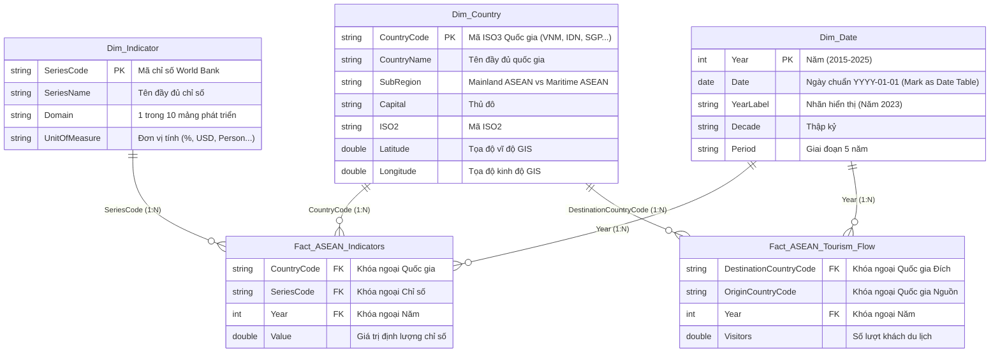

# 🌏 ASEAN SOCIO-ECONOMIC DEVELOPMENT ANALYSIS (2015 - 2025)
> **Capstone Project:** Production-Grade Data Engineering Pipeline, Star Schema Modeling, Automated Data Quality CI/CD Testing & Power BI Business Intelligence Dashboard Solution.

[](file:///D:/kelangthanghocIT/UTH/capstone-asean_overview_analysis/08_Source_Code/main.py)
[](file:///D:/kelangthanghocIT/UTH/capstone-asean_overview_analysis/03_Data_Preprocessing/Python/test_suite.py)
[](file:///D:/kelangthanghocIT/UTH/capstone-asean_overview_analysis/05_PowerBI)
[](https://databank.worldbank.org/)

---

## 📌 1. TỔNG QUAN DỰ ÁN (PROJECT EXECUTIVE SUMMARY)

Khu vực **ASEAN (Hiệp hội các quốc gia Đông Nam Á)** là một trong những động lực tăng trưởng kinh tế năng động nhất thế giới. Dự án `capstone-asean_overview_analysis` thu thập, hợp nhất, làm sạch và mô hình hóa dữ liệu phát triển 10 năm (2015–2025) từ **World Bank (World Development Indicators)** cho **10 quốc gia thành viên ASEAN** (Brunei Darussalam, Cambodia, Indonesia, Lao PDR, Malaysia, Myanmar, Philippines, Singapore, Thailand, Viet Nam) và quốc gia quan sát viên **Timor-Leste**.

### 🌟 10 Mảng Phát Triển Trọng Yếu (Socio-Economic Domains):
1. 📈 **Kinh tế & GDP** (Economy, GDP, Inflation, Gross Capital Formation)
2. 👥 **Dân số & Nhân khẩu học** (Population Growth, Urbanization, Age Dependency)
3. 🚢 **Thương mại & Xuất nhập khẩu** (Trade Openness % GDP, Exports, Imports)
4. 💰 **Đầu tư trực tiếp nước ngoài (FDI)** (FDI Net Inflows & Inflow % GDP)
5. 🌐 **Công nghệ & Hạ tầng số** (Internet Users %, Mobile Subscriptions, Fixed Broadband)
6. 🎓 **Giáo dục & Đào tạo** (Literacy Rates, School Enrollment, Primary/Secondary)
7. 💼 **Lao động & Việc làm** (Labor Force Participation, Unemployment Rates)
8. 🍃 **Môi trường & Năng lượng** (CO2 Emissions, Renewable Energy, Electricity Access)
9. ✈️ **Du lịch & Dịch vụ** (Intra-ASEAN Arrivals Matrix & International Tourism)
10. 🏥 **Y tế & Sức khỏe** (Life Expectancy, Hospital Beds, Immunization Rates)

---

## 🏗️ 2. QUẢN LÝ CẤU TRÚC DỰ ÁN (REPOSITORY STRUCTURE)

```text
capstone-asean_overview_analysis/
├── .gitignore                      # Cấu hình bỏ qua tệp tạm/venv/cache
├── LICENSE                         # Giấy phép bản quyền mở chuẩn MIT License
├── README.md                       # Tài liệu dự án chi tiết (Tệp này)
│
├── 01_Project_Document/            # Tài liệu đồ án chính thức
│   ├── Final_Report.docx           # Báo cáo tổng kết đồ án
│   ├── Presentation.pptx           # Slide thuyết trình đồ án
│   ├── Proposal.docx               # Đề xuất dự án ban đầu
│   └── References.pdf              # Danh mục tài liệu tham khảo
│
├── 02_Data/
│   ├── Cleaned/                    # Bộ dữ liệu sạch mô hình Star Schema (CSV)
│   │   ├── Fact_ASEAN_Indicators.csv    (6,730 bản ghi sự kiện các chỉ số)
│   │   ├── Fact_ASEAN_Tourism_Flow.csv  (917 bản ghi ma trận luồng du lịch)
│   │   ├── Dim_Country.csv              (11 quốc gia kèm GIS & SubRegion)
│   │   ├── Dim_Indicator.csv            (65 chỉ số phân loại 10 mảng)
│   │   ├── Dim_Date.csv                 (11 năm 2015-2025 kèm cột Date YYYY-01-01)
│   │   └── ASEAN_Master_Cleaned.csv     (7,850 bản ghi master phục vụ đối soát)
│   ├── External/                   # Thư mục chứa dữ liệu địa lý mở rộng (.gitkeep)
│   ├── Metadata/                   # Định nghĩa gốc World Bank & Data Dictionary
│   │   ├── Data_Dictionary.md       (Từ điển dữ liệu chi tiết từng cột/bảng)
│   │   └── *-Metadata.csv           (9 tệp metadata gốc từ World Bank)
│   └── Raw/                        # 10 tệp CSV dữ liệu thô ban đầu (Wide Format)
│
├── 03_Data_Preprocessing/
│   ├── PowerQuery/                 # Script M-code nạp Star Schema (Load_Star_Schema.m)
│   ├── Python/                     # Công cụ ETL, Validation & Unit Tests
│   │   ├── clean_and_transform.py   (Kịch bản ETL chuyển Wide -> Long Format)
│   │   ├── test_suite.py            (Bộ kiểm thử tự động CI/CD Data Quality 5/5 passed)
│   │   ├── audit_dataset.py         (Kịch bản kiểm tra tính toàn vẹn tham chiếu)
│   │   ├── deep_data_validation.py  (Kịch bản kiểm định retention rate 100%)
│   │   ├── deep_exploratory_analysis.py (EDA chuyên sâu với Senior Analyst Code)
│   │   └── generate_notebooks.py   (Kịch bản khởi tạo tự động Jupyter Notebooks)
│   └── SQL/                        # Script DDL RDBMS & Views (create_tables_and_views.sql)
│
├── 04_Analysis/
│   ├── EDA.ipynb                   # Jupyter Notebook Khám phá Dữ liệu
│   ├── Statistics.ipynb            # Jupyter Notebook Phân tích Thống kê
│   └── Insights.md                 # Báo cáo điểm tin phân tích kinh tế - xã hội ASEAN
│
├── 05_PowerBI/
│   ├── Custom Visuals/             # Thư mục lưu Custom Visuals (.gitkeep)
│   ├── Dataset/                    # Thư viện DAX Measures (DAX_Measures.dax)
│   ├── Export/                     # Thiết kế UX/UI Blueprint & Báo cáo PDF
│   │   └── Dashboard_Specification.md (Bản thiết kế UI/UX & Wireframe 4 trang)
│   ├── PBIP/                       # Thư mục định dạng Power BI Project (.gitkeep)
│   └── Theme/                      # Theme màu tối ASEAN (ASEAN_Dark_Professional_Theme.json)
│
├── 06_Images/                      # Hình ảnh tài liệu (.gitkeep)
├── 07_Dashboard_Screenshots/       # Ảnh chụp giao diện Dashboard (.gitkeep)
└── 08_Source_Code/
    └── main.py                     # Kịch bản điều phối Master Pipeline tự động
```

---

## ⭐️ 3. MÔ HÌNH DỮ LIỆU NGÔI SAO (STAR SCHEMA ARCHITECTURE)

Dữ liệu được chuẩn hóa theo mô hình **3-Tier Star Schema**, tách bạch giữa bảng sự kiện (Fact) và các bảng danh mục (Dimension) giúp tối ưu hóa bộ nén cột VertiPaq trên Power BI:



---

## 📊 4. ĐIỂM TIN NỔI BẬT NĂNG LỰC PHÂN TÍCH (EMPIRICAL FINDINGS)

Trích xuất trực tiếp từ bộ dữ liệu 7,647 bản ghi sạch thông qua [deep_exploratory_analysis.py](file:///D:/kelangthanghocIT/UTH/capstone-asean_overview_analysis/03_Data_Preprocessing/Python/deep_exploratory_analysis.py):

### 1. Quy mô GDP & Độ tập trung Kinh tế toàn khối ASEAN (2015 - 2023)
- **Tăng trưởng quy mô:** Tổng GDP toàn khối ASEAN tăng từ **$2.530 Trillion USD (năm 2015)** lên **$3.262 Trillion USD (năm 2019)** và đạt **$3.812 Trillion USD (năm 2023)** (+50.7%).
- **Độ tập trung Top 3 (62.94%):** 3 nền kinh tế lớn nhất (**Indonesia $1.37T**, **Thái Lan $517B**, **Singapore $511B**) giữ vững **62.94%** tổng GDP khu vực.
- **Sự vươn lên của Việt Nam:** Việt Nam (`VNM`) đạt GDP **$433.81 Billion USD (năm 2023)**, đứng thứ 5 toàn khối ASEAN (sát nút Philippines $437B).

| Quốc gia | GDP 2015 (USD) | GDP 2019 (USD) | GDP 2023 (USD) | Tỷ trọng 2023 (%) |
| :--- | :---: | :---: | :---: | :---: |
| **Indonesia** | $860.85 Billion | $1,119.10 Billion | **$1,371.17 Billion** | **35.97%** |
| **Thailand** | $401.30 Billion | $543.98 Billion | **$517.01 Billion** | **13.56%** |
| **Singapore** | $308.00 Billion | $376.83 Billion | **$511.18 Billion** | **13.41%** |
| **Philippines** | $306.45 Billion | $376.82 Billion | **$437.06 Billion** | **11.46%** |
| **Viet Nam** | $239.26 Billion | $334.36 Billion | **$433.81 Billion** | **11.38%** |

### 2. Bước nhảy Chuyển đổi số (Internet User % Growth 2015 vs 2023)
- **Cambodia (`KHM`):** Nhảy vọt kỷ lục **+62.49 điểm phần trăm** (từ 6.43% năm 2015 vọt lên 68.93% năm 2023).
- **Thailand (`THA`):** Tăng +50.22 điểm % (từ 39.32% lên 89.54%).
- **Indonesia (`IDN`):** Tăng +47.15 điểm % (từ 22.06% lên 69.21%).
- **Lao PDR (`LAO`):** Tăng +46.20 điểm % (từ 18.20% lên 64.40%).
- **Viet Nam (`VNM`):** Đạt mốc **78.08%** bao phủ Internet năm 2023.

### 3. Hành lan Du lịch Nội khối (Intra-ASEAN Tourism Corridors)
- **Tuyến 1 (Singapore $\rightarrow$ Malaysia):** Đạt 8.31 triệu lượt khách (năm 2023).
- **Tuyến 2 (Malaysia $\rightarrow$ Thailand):** Vượt mốc trước dịch, đạt **4.63 triệu lượt khách (năm 2023)** so với 4.27M năm 2019.
- **Tuyến 3 (Indonesia $\rightarrow$ Malaysia):** Đạt 3.11 triệu lượt khách (năm 2023).

---

## 🧪 5. BỘ KIỂM THỬ TỰ ĐỘNG CI/CD DATA QUALITY (5/5 PASSED)

Hệ thống tích hợp bộ kiểm thử tự động [test_suite.py](file:///D:/kelangthanghocIT/UTH/capstone-asean_overview_analysis/03_Data_Preprocessing/Python/test_suite.py) chuẩn `unittest` đảm bảo độ tin cậy dữ liệu 100%:

```bash
python 03_Data_Preprocessing/Python/test_suite.py
```

```text
.....
----------------------------------------------------------------------
Ran 5 tests in 0.376s

OK (ALL 5 TESTS PASSED)
```

| Tên Bài Test | Mục Tiêu Kiểm Định | Trạng Thái |
| :--- | :--- | :---: |
| `test_fact_indicators_grain_uniqueness` | Đảm bảo 0% trùng lặp khóa `(CountryCode, SeriesCode, Year)` trong Fact chính | **PASSED** |
| `test_tourism_flow_grain_uniqueness` | Đảm bảo 0% trùng lặp khóa `(Destination, Origin, Year)` trong Fact luồng du lịch | **PASSED** |
| `test_referential_integrity` | Đảm bảo 100% khóa ngoại tồn tại trong các bảng Chiều `Dim_Country` & `Dim_Indicator` | **PASSED** |
| `test_numeric_value_validity` | Đảm bảo 0 bản ghi lỗi `NaN` hay `Inf` trong cột giá trị định lượng | **PASSED** |
| `test_dim_date_continuity` | Đảm bảo tính liên tục 100% của 11 năm (2015 đến 2025) | **PASSED** |

---

## 🚀 6. HƯỚNG DẪN THỰC THI & IMPORT VÀO POWER BI (DEPLOYMENT GUIDE)

### Lệnh 1: Điều phối Master Pipeline tự động (One-Command Execution)
Chỉ cần chạy 1 dòng lệnh duy nhất để tự động thực thi làm sạch dữ liệu, chạy bộ kiểm thử CI/CD và tái tạo Jupyter Notebooks:

```bash
python 08_Source_Code/main.py
```

### Lệnh 2: Import & Thiết kế trên Power BI Desktop
1. **Nạp dữ liệu:** Mở Power BI Desktop $\rightarrow$ `Get Data` $\rightarrow$ Nạp 5 tệp CSV từ [02_Data/Cleaned](file:///D:/kelangthanghocIT/UTH/capstone-asean_overview_analysis/02_Data/Cleaned) (hoặc dán M-code từ [Load_Star_Schema.m](file:///D:/kelangthanghocIT/UTH/capstone-asean_overview_analysis/03_Data_Preprocessing/PowerQuery/Load_Star_Schema.m)).
2. **Đánh dấu Date Table:** Đấp chuột phải `Dim_Date` $\rightarrow$ `Mark as date table` $\rightarrow$ Chọn cột `Date`.
3. **Nạp DAX Measures:** Sao chép các chỉ số từ [DAX_Measures.dax](file:///D:/kelangthanghocIT/UTH/capstone-asean_overview_analysis/05_PowerBI/Dataset/DAX_Measures.dax) (`GDP (Current US$)`, `GDP YoY %`, `GDP Rank ASEAN`...).
4. **Áp dụng Custom Theme:** Vào `View` $\rightarrow$ `Themes` $\rightarrow$ Nạp tệp giao diện tối [ASEAN_Dark_Professional_Theme.json](file:///D:/kelangthanghocIT/UTH/capstone-asean_overview_analysis/05_PowerBI/Theme/ASEAN_Dark_Professional_Theme.json).
5. **Thiết kế theo Blueprint:** Xem bản vẽ UI/UX wireframe 4 trang tại [Dashboard_Specification.md](file:///D:/kelangthanghocIT/UTH/capstone-asean_overview_analysis/05_PowerBI/Export/Dashboard_Specification.md).

---

## 📜 7. GIẤY PHÉP BẢN QUYỀN (LICENSE)

Dự án được phát hành dưới giấy phép mã nguồn mở **MIT License**. Chi tiết xem tại tệp [LICENSE](file:///D:/kelangthanghocIT/UTH/capstone-asean_overview_analysis/LICENSE).
