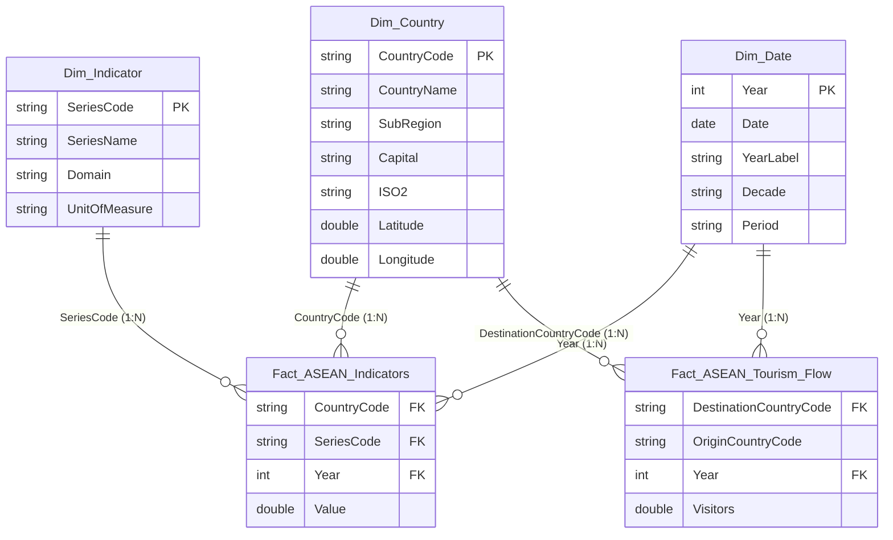

# 🌏 BÁO CÁO PHÂN TÍCH TỔNG QUAN PHÁT TRIỂN CÁC NƯỚC ASEAN (2015 - 2025)
> **Dự án Đồ án Tốt nghiệp / Capstone Project:** Phân tích Dữ liệu Phát triển Kinh tế - Xã hội ASEAN, Chuẩn hóa Star Schema và Xây dựng Báo cáo Power BI Dashboard.

---

## 📌 1. TỔNG QUAN DỰ ÁN (PROJECT OVERVIEW)

Khu vực **ASEAN (Hiệp hội các quốc gia Đông Nam Á)** là một trong những khu vực kinh tế phát triển năng động nhất thế giới. Dự án `capstone-asean_overview_analysis` thực hiện thu thập, làm sạch, mô hình hóa và phân tích bộ dữ liệu phát triển 10 năm (2015–2025) hợp nhất từ **World Bank (World Development Indicators)** cho **10 quốc gia thành viên ASEAN** (Brunei, Campuchia, Indonesia, Lào, Malaysia, Myanmar, Philippines, Singapore, Thái Lan, Việt Nam) cùng quốc gia quan sát viên **Timor-Leste**.

Bộ dữ liệu bao gồm **65 chỉ số phát triển** trải dài trên **10 lĩnh vực trọng yếu**:
1. **Kinh tế & GDP** (Economy & GDP)
2. **Dân số & Nhân khẩu học** (Demographics & Population)
3. **Thương mại & Xuất nhập khẩu** (Trade & International Commerce)
4. **Đầu tư trực tiếp nước ngoài (FDI)** (Foreign Direct Investment)
5. **Công nghệ & Hạ tầng số** (Technology & Digital Infrastructure)
6. **Giáo dục & Đào tạo** (Education & Human Capital)
7. **Lao động & Việc làm** (Employment & Labor Force)
8. **Môi trường & Năng lượng** (Environment & Energy)
9. **Du lịch & Dịch vụ** (Tourism & Services)
10. **Y tế & Sức khỏe** (Healthcare & Well-being)

---

## 🏗️ 2. CẤU TRÚC THƯ MỤC DỰ ÁN (REPOSITORY STRUCTURE)

```text
capstone-asean_overview_analysis/
├── .gitignore                      # Cấu hình bỏ qua các tệp tạm/venv/cache của Git
├── LICENSE                         # Giấy phép bản quyền mở chuẩn MIT License
├── README.md                       # Tài liệu hướng dẫn dự án chi tiết (File này)
│
├── 01_Project_Document/            # Tài liệu đồ án (Proposal, Final Report, Presentation, References)
│
├── 02_Data/
│   ├── Cleaned/                    # Bộ dữ liệu sạch mô hình Star Schema (CSV)
│   │   ├── Fact_ASEAN_Indicators.csv    (6,730 bản ghi sự kiện các chỉ số)
│   │   ├── Fact_ASEAN_Tourism_Flow.csv  (917 bản ghi ma trận luồng du lịch)
│   │   ├── Dim_Country.csv              (11 quốc gia kèm GIS & SubRegion)
│   │   ├── Dim_Indicator.csv            (65 chỉ số & phân loại 10 mảng)
│   │   ├── Dim_Date.csv                 (11 năm 2015-2025 kèm trường Date)
│   │   └── ASEAN_Master_Cleaned.csv     (7,850 bản ghi master đối soát)
│   ├── External/                   # Dữ liệu địa lý mở rộng (Đã thêm .gitkeep)
│   ├── Metadata/                   # 9 tệp CSV định nghĩa gốc từ World Bank
│   └── Raw/                        # 10 tệp CSV dữ liệu thô ban đầu (Wide Format)
│
├── 03_Data_Preprocessing/
│   ├── PowerQuery/                 # Script M-code nạp Star Schema (Load_Star_Schema.m)
│   ├── Python/                     # Công cụ ETL & Validation (clean_and_transform.py, audit_dataset.py...)
│   └── SQL/                        # Script DDL khởi tạo RDBMS & Views (create_tables_and_views.sql)
│
├── 04_Analysis/
│   ├── EDA.ipynb                   # Jupyter Notebook Khám phá Dữ liệu EDA
│   ├── Statistics.ipynb            # Jupyter Notebook Phân tích Thống kê & GDP
│   └── Insights.md                 # Báo cáo điểm tin phân tích kinh tế - xã hội ASEAN
│
├── 05_PowerBI/
│   ├── Custom Visuals/             # Thư mục lưu Custom Visuals (Đã thêm .gitkeep)
│   ├── Dataset/                    # Thư viện DAX Measures (DAX_Measures.dax)
│   ├── Export/                     # Thư mục xuất file báo cáo (Đã thêm .gitkeep)
│   ├── PBIP/                       # Thư mục định dạng Power BI Project (Đã thêm .gitkeep)
│   └── Theme/                      # Cấu hình giao diện màu tối ASEAN (ASEAN_Dark_Professional_Theme.json)
│
├── 06_Images/                      # Thư mục chứa hình ảnh tài liệu
├── 07_Dashboard_Screenshots/       # Thư mục chứa ảnh chụp Dashboard
└── 08_Source_Code/
    └── main.py                     # Kịch bản điều phối chạy lại toàn bộ Pipeline dự án
```

---

## ⭐️ 3. MÔ HÌNH DỮ LIỆU NGÔI SAO (STAR SCHEMA ARCHITECTURE)

Dữ liệu được chuẩn hóa theo mô hình **Star Schema** tối ưu hóa bộ nén cột VertiPaq trên Power BI Desktop:



---

## 📊 4. ĐIỂM TIN NỔI BẬT NĂNG LỰC PHÂN TÍCH (KEY ANALYTICAL FINDINGS)

Dựa trên kịch bản kiểm thử dữ liệu thực tế:

1. **Quy mô Kinh tế ASEAN (GDP):**
   - Tổng GDP toàn khối tăng từ **2,530 tỷ USD (năm 2015)** lên **3,812 tỷ USD (năm 2023)**.
   - Top 3 nền kinh tế lớn nhất (**Indonesia $1.37T**, **Thái Lan $517B**, **Singapore $511B**) liên tục chiếm **~62.9%** tổng sản lượng GDP cả khu vực.
   - **Việt Nam** vươn lên mốc **$433.81 tỷ USD (năm 2023)**, đứng thứ 5 toàn khu vực ASEAN.

2. **Bước nhảy Chuyển đổi số (Internet Penetration):**
   - **Campuchia** ghi nhận bước nhảy vọt thần tốc nhất khối: **+62.49 điểm %** (từ 6.43% năm 2015 vọt lên 68.93% năm 2023).
   - Thái Lan (+50.22%), Indonesia (+47.15%), Lào (+46.20%), Việt Nam (78.08%).

3. **Hành lang Du lịch Nội khối (Tourism Flow):**
   - Hành lang lớn nhất: **Singapore $\rightarrow$ Malaysia** (đạt 8.31 triệu lượt khách năm 2023).
   - Hành lang phục hồi vượt mốc trước dịch: **Malaysia $\rightarrow$ Thailand** (đạt 4.63 triệu lượt khách năm 2023 so với 4.27M năm 2019).

---

## 🚀 5. HƯỚNG DẪN THỰC THI & IMPORT VÀO POWER BI

### Bước 1: Chạy lại toàn bộ ETL Pipeline (Nếu cần cập nhật dữ liệu)
Mở terminal tại thư mục gốc dự án và gõ lệnh:
```bash
python 08_Source_Code/main.py
```
*Lệnh này sẽ tự động làm sạch 10 file raw, tạo mô hình Star Schema trong `02_Data/Cleaned/` và khởi tạo lại các Jupyter Notebooks.*

### Bước 2: Import vào Power BI Desktop
1. Mở Power BI Desktop $\rightarrow$ Chọn `Get Data` $\rightarrow$ `Text/CSV`.
2. Trỏ tới thư mục [02_Data/Cleaned](file:///D:/kelangthanghocIT/UTH/capstone-asean_overview_analysis/02_Data/Cleaned) và nạp 5 file:
   - `Fact_ASEAN_Indicators.csv`
   - `Fact_ASEAN_Tourism_Flow.csv`
   - `Dim_Country.csv`
   - `Dim_Indicator.csv`
   - `Dim_Date.csv`
*(Hoặc dán kịch bản M-code từ [03_Data_Preprocessing/PowerQuery/Load_Star_Schema.m](file:///D:/kelangthanghocIT/UTH/capstone-asean_overview_analysis/03_Data_Preprocessing/PowerQuery/Load_Star_Schema.m) vào Advanced Editor).*

### Bước 3: Cấu hình Model & DAX
1. **Đánh dấu Date Table:** Đấp chuột phải bảng `Dim_Date` $\rightarrow$ `Mark as date table` $\rightarrow$ Chọn cột `Date`.
2. **Nạp DAX Measures:** Mở tệp [05_PowerBI/Dataset/DAX_Measures.dax](file:///D:/kelangthanghocIT/UTH/capstone-asean_overview_analysis/05_PowerBI/Dataset/DAX_Measures.dax) và sao chép các công thức `GDP (Current US$)`, `GDP YoY %`, `GDP Rank ASEAN` vào Power BI.
3. **Áp dụng Theme giao diện:** Vào `View` $\rightarrow$ `Themes` $\rightarrow$ `Browse for themes` $\rightarrow$ Chọn tệp [05_PowerBI/Theme/ASEAN_Dark_Professional_Theme.json](file:///D:/kelangthanghocIT/UTH/capstone-asean_overview_analysis/05_PowerBI/Theme/ASEAN_Dark_Professional_Theme.json).

---

## 📜 6. GIẤY PHÉP BẢN QUYỀN (LICENSE)

Dự án được phát hành dưới giấy phép **MIT License**. Bạn có quyền tự do sử dụng, chỉnh sửa và phát triển cho các mục đích nghiên cứu và báo cáo BI.
