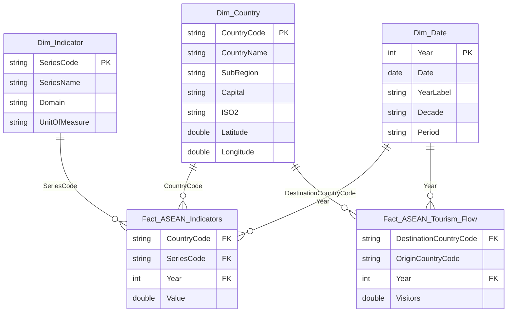

# 🌏 ASEAN Overview & Socio-Economic Analysis (2015 - 2025)
**Capstone Project - Data Processing, Analytics & Power BI Dashboard Report**

---

## 📌 Project Overview
This project provides a comprehensive socio-economic development analysis of the 10 **ASEAN member countries** (Brunei, Cambodia, Indonesia, Lao PDR, Malaysia, Myanmar, Philippines, Singapore, Thailand, Viet Nam) and Timor-Leste over the 2015–2025 decade.

The dataset integrates 65 development indicators sourced from the **World Bank**, structured across 10 critical domains:
1. **Kinh tế & GDP** (Economy & GDP)
2. **Dân số & Nhân khẩu học** (Demographics & Population)
3. **Thương mại & Xuất nhập khẩu** (Trade & International Commerce)
4. **Đầu tư trực tiếp nước ngoài (FDI)** (Foreign Direct Investment)
5. **Công nghệ & Hạ tầng số** (Technology & Digital Infrastructure)
6. **Giáo dục & Đào tạo** (Education & Human Capital)
7. **Lao động & Việc làm** (Employment & Labor Force)
8. **Môi trường & Năng lượng** (Environment & Energy)
9. **Du lịch & Dịch vụ** (Tourism & Services)
10. **Y tế & Sức khỏe** (Healthcare & Well-being)

---

## 🏗️ Repository Architecture

```text
capstone-asean_overview_analysis/
├── 01_Project_Document/          # Proposal, Final Report, Presentation, References
├── 02_Data/
│   ├── Raw/                       # 10 World Bank raw CSV indicator files
│   ├── Metadata/                  # Indicator definitions and World Bank notes
│   ├── Cleaned/                   # Star Schema CSVs (Fact_ASEAN_Indicators, Fact_ASEAN_Tourism_Flow, Dim_Country, Dim_Indicator, Dim_Date)
│   └── External/                  # GIS & External regional benchmarks
├── 03_Data_Preprocessing/
│   ├── Python/                    # Automated ETL script (clean_and_transform.py)
│   ├── PowerQuery/                # Power Query M M-code script (Load_Star_Schema.m)
│   └── SQL/                       # RDBMS DDL & Analytical Views (create_tables_and_views.sql)
├── 04_Analysis/
│   ├── EDA.ipynb                  # Exploratory Data Analysis notebook
│   ├── Statistics.ipynb           # Descriptive & correlation statistics notebook
│   └── Insights.md                # Executive summary & key data findings
├── 05_PowerBI/
│   ├── Dataset/                   # DAX Measure Library (DAX_Measures.dax)
│   ├── Theme/                     # Custom ASEAN Dark Theme JSON
│   └── Export/                    # Dashboard screenshots and PDF exports
├── 08_Source_Code/
│   └── main.py                    # Master pipeline runner
└── README.md                      # Project documentation
```

---

## ⭐ Star Schema Data Model

The clean dataset follows a 3-tier **Star Schema** optimized for Power BI columnar storage (VertiPaq engine):



---

## 🚀 Execution & Setup Guide

### 1. Run Data Cleaning & Transformation
To process all 10 raw datasets and regenerate the Star Schema CSVs in `02_Data/Cleaned`:

```bash
python 08_Source_Code/main.py
```

### 2. Import into Power BI Desktop
1. Open Power BI Desktop.
2. Load CSV files from `02_Data/Cleaned/`: `Fact_ASEAN_Indicators.csv`, `Fact_ASEAN_Tourism_Flow.csv`, `Dim_Country.csv`, `Dim_Indicator.csv`, `Dim_Date.csv`.
3. Alternatively, copy-paste the M-code script from `03_Data_Preprocessing/PowerQuery/Load_Star_Schema.m` into the Advanced Editor.
4. Mark `Dim_Date` as Date Table using the `Date` column.
5. Import DAX measures from `05_PowerBI/Dataset/DAX_Measures.dax`.
6. Apply custom theme `05_PowerBI/Theme/ASEAN_Dark_Professional_Theme.json`.

---

## 📈 Key DAX Measures Provided
- **Base Aggregations:** `[GDP (Current US$)]`, `[GDP Growth Rate (%)]`, `[Total Population]`, `[Internet Users (% Pop)]`.
- **Time Intelligence:** `[Indicator Value PY]`, `[Indicator Value YoY %]`, `[GDP YoY %]`.
- **Benchmarking & Ranking:** `[GDP Rank ASEAN]`, `[GDP Share of ASEAN (%)]`.
- **Dynamic Formatting:** `[Dynamic Dashboard Title]`.

---

## 📝 License & Citation
Project created for ASEAN socio-economic development research & Power BI analytics demonstration. Data sourced from World Development Indicators (World Bank).
